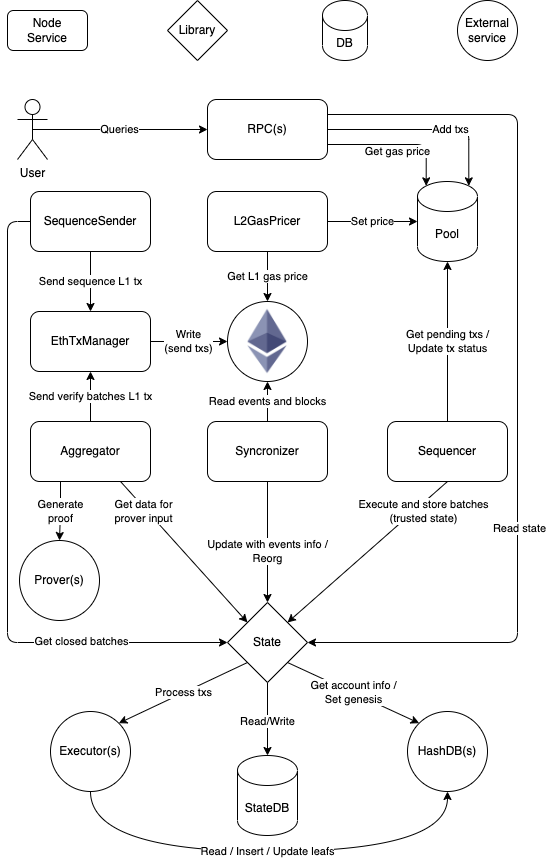

# hermez-core

Hermez Core is a Go implementation of a node that operates the zkEVM Hermez Network.

## About the zkEVM Hermez Network

Since this is an implementation of a protocol it's fundamental to understand it, [here](https://hackmd.io/tEny6MhSQaqPpu4ltUyC_w) you can find the specification of the protocol.

The protocol defines three phases of development, the repo currently implements:

- [ ] v1.3: almost fully implemented
- [ ] v1.5: WIP
- [ ] v2.0: WIP

*Note that in terms of feature set, v1.5 and v2.0 are the same from the point of view of the node.*

## Architecture

*It's important to note that currently this implementation is a monolith monorepo, but this is very likely to change in the near future.*

  

The diagram represents the main components of the software and how they interact between them:

- RPC: interface that allow users (metamask, etherscan, ...) to interact with the node. Fully compatible with Ethereum RPC + some extra endpoints specifics of the network.
- Pool: DB that stores txs to be selected/discarded by the `sequencer`
- Sequencer: get txs from the `pool`, check if they are valid by processing them using the `state` and group a sequence of txs into a batch that then sends to Ethereum using the `etherman`. The goal of the sequencer is to maximize profit extracted of the txs gas fees, as described in the PoE protocol.
- Etherman: abstraction that implements the needed methods to interact with the Ethereum network and the relevant smart contracts.
- Synchronizer: Updates the `state` by fetching data from Ethereum through the `etherman`.
- State: process txs using the EVM and the Merkletree, and manage all the metadata (batches, events, receipts, logs, ...).
- Aggregator: consolidates batches by generating ZK proofs. To do so it gathers the necessary data that the `prover` needs as input. Once the prove is generated it's sent to Ethereum through the `etherman`.
- Prover: service that generates ZK proofs. Note that this component is not implemented in this repository, and it's treated as a "black box" from the perspective of the node. The prover has two implementations: [JS reference implementation](https://github.com/hermeznetwork/zkproverjs) and [C production ready implementation](https://github.com/hermeznetwork/zkproverc).

## Development

It's recommended to use `make` for building, testing the code, ... Run `make help` to get a list of the available commands.

### Requirements

- Go 1.16
- Docker
- Docker Compose
