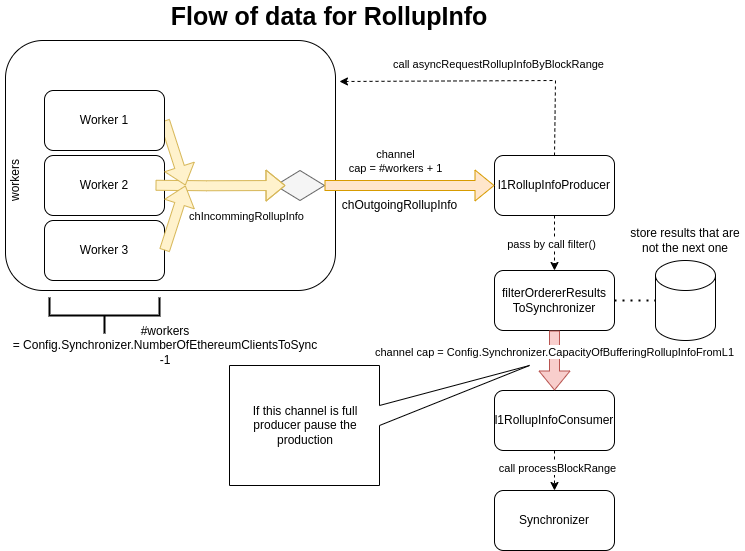

# L1 parallel synchronization
This is a refactor of L1 synchronization to improve speed.
- It asks for data in parallel  to L1 while another goroutine is concurrently executing the rollup info.
- It makes that the executor be occupied 100% of the time.

## Pending to do  
- Some test on ` synchronizer/synchronizer_test.go` are based on this feature, so are running against legacy code

## Configuration
You could choose between new L1 parallel sync or sequential one (legacy): 
```
[Synchronizer]
L1SynchronizationMode = "parallel"
```
If you activate this feature you can configure:
- `MaxClients`: how many parallel request can be done. You must consider that 1 is just for requesting the last block on L1, and the rest for rollup info
- `MaxPendingNoProcessedBlocks`:  buffer of data pending to be processed. This is the queue data to be executed by consumer.

For a full description of fields please check config-file documentation.

Example: 
```
L1SynchronizationMode = parallel
	[Synchronizer.L1ParallelSynchronization]
		MaxClients = 10
		MaxPendingNoProcessedBlocks = 25
		RequestLastBlockPeriod = "5s"
		RequestLastBlockTimeout = "5s"
		RequestLastBlockMaxRetries = 3
		StatisticsPeriod = "5m"
		TimeoutMainLoop = "5m"
		RollupInfoRetriesSpacing= "5s"
		FallbackToSequentialModeOnSynchronized = false
		[Synchronizer.L1ParallelSynchronization.PerformanceWarning]
			AceptableInacctivityTime = "5s"
			ApplyAfterNumRollupReceived = 10

```
## Remakable logs
### How to known the occupation of executor
To check that executor are fully ocuppied you can check next log:
```
consumer: processing rollupInfo #808: range:[9606297, 9606397] num_blocks [7] statistics:wasted_time_waiting_for_data [0s] last_process_time [27.557166427s] block_per_second [0.318281]
```
The `wasted_time_waiting_for_data` show the waiting time between this call and the previous to executor. It could generate a warning depending on the configuring `SSynchronizer.L1ParallelSynchronization.PerformanceWarning`

### Estimated time to be fully synchronizer with L1
This log show the estimated time (**ETA**) to reach the block goal. You can configure the frequency with var `StatisticsPeriod`
```
INFO	producer: Statistics: EstimatedTimeOfArrival: 1h58m42.730543611s percent:0.15  blocks_per_seconds:201.24 pending_block:2222/1435629 num_errors:0
```

## Flow of data



### The main objects are:
- `l1SyncOrchestration`: is the entry point and the reponsable to launch the producer and consumer
- `l1RollupInfoProducer`: this object send rollup data through the channel to the consumer
- `l1RollupInfoConsumer`: that receive the data and execute it


