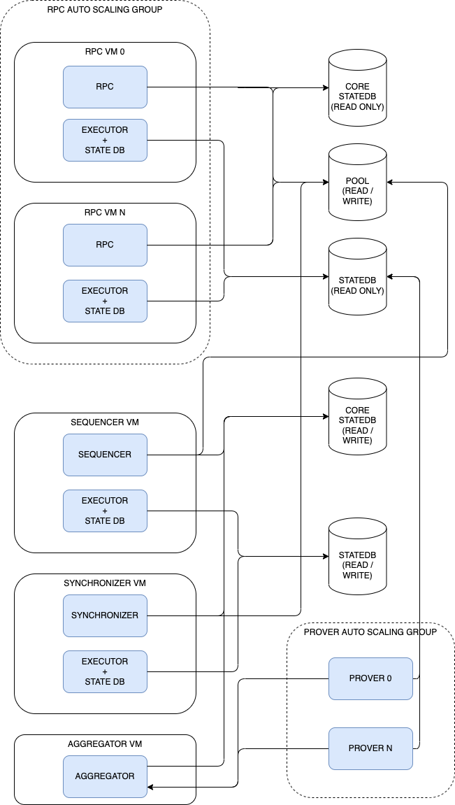
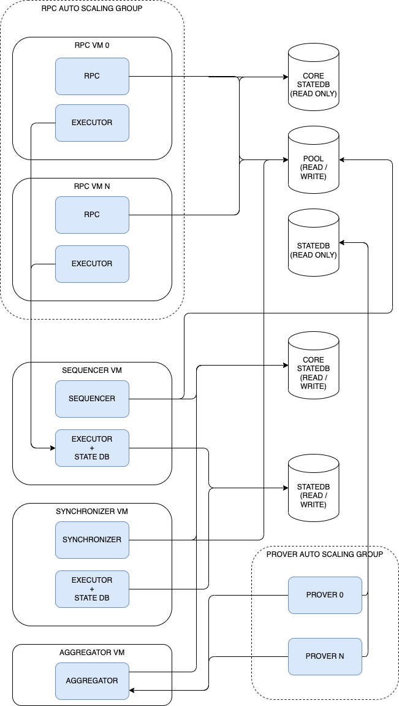

# Infrastructure setup

This documetn describes how the different components should be configured and deployed in order to maximize performance. It currently focus on a setup where the sequencer should achieve top performance while also serving users through JSON RPC instance. Note that this setup may not be recommended for other purposes such as focusing on serving JSON RPC only

## Setup without changes to the existing code

There is no one single solution that looks obviously better, primarly there is a trade off between two setups.

Note that in both cases:

- the instances of the executor used by the syncjronizer also run the StateDB service. This is done because the synchronizer **in this particular setup** where it runs besides the trusted sequencer will only write to the Merkletree in case of L2 reorgs which should never happen. There fore it's assumed that it's better to not interfere in the performance of the other components by sharing a StateDB service since anyway it shouldn't add entries to the cache
- the aggregator uses a read replica of the (postgres) stateDB

### Option A: cache NOT shared

  

In this setup, each executor uses it's own cache (executor + stateDB run in the same process)

PROS:

- RPC does not affect the performance of the sequencer executor, which is the thing where we need more performance

CONS:

- Pre executions are not happening in the same cache as the sequencer's executors, and this will have the counter effect of reducing the amount of hits

### Option B: shared cache

  

In this setup, the RPC instances use the same StateDB as the sequencer's executor. Note that the StateDB service runs in the same process as the sequencer's executor. This is done to reduce latency between executor ==> state DB for the sequencer, but this could create a performance impact, and separating the stae DB in another instance could be an option.

PROS:

- Pre executions done in the RPCs will add entries to the cache of the State DB that the sequencer will use later on

CONS:

- All the queries that the RPC needs to do will go through the same State DB of the sequencer. Including the ones that are not related to sequencing transactions. This can potentially be a huge work load that can affect the performance of the sequencer
- Because all the accesses to the (postgres) StateDB are centraliized through a single StateDB (service) it's not possible to take advantadge of read replicas of the postgres (without changes in the code)

## Advanced setup

### Better way to share cache

In order to have the best of both options, it would be ideal if the RPCs could choose if they can use the sequencer's StateDB service or not. This could be achieved by:

A) A gRPC flag indicating if local/remote StateDB should be used
B) Having two endpoints in the RPC instance one for shared/local cache

### Split RPC scaling group

The above proposal uses a RPC scaling group that have a 1:1 mapping of rpc:executor services, but the truth is that this doesn't make a lot of sense. Ideally, RPCs should connect to an autoscaling group of executors, this way RPC and Executor services could scale separatedly according to the system load