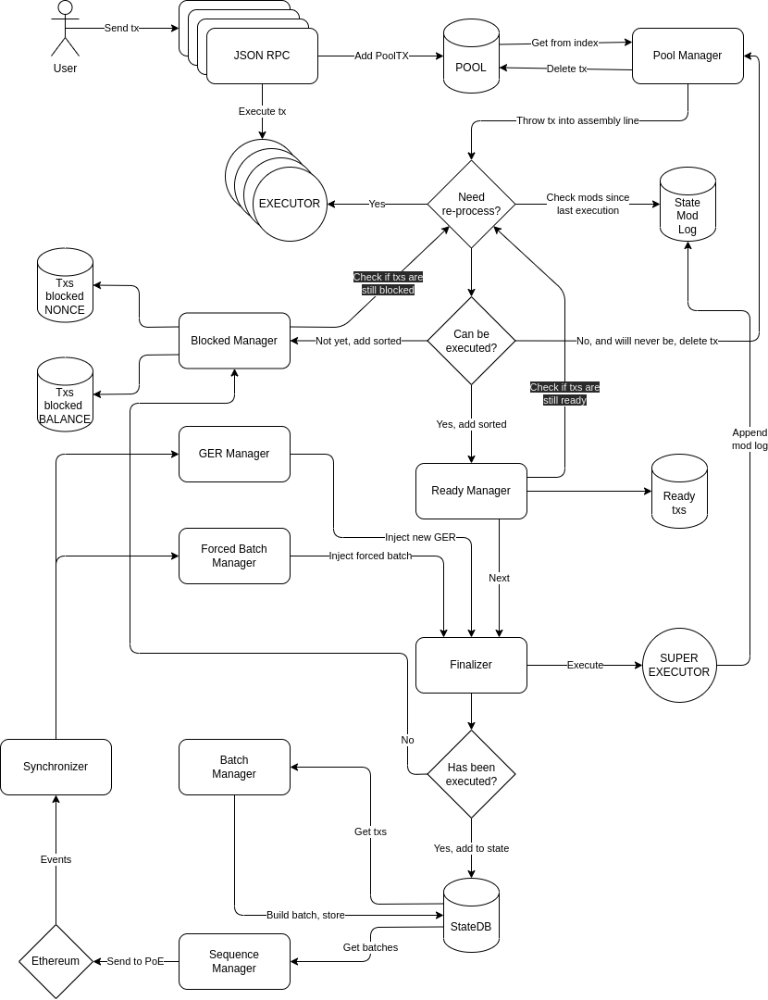
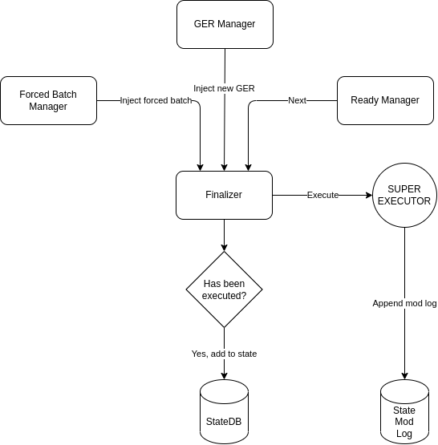
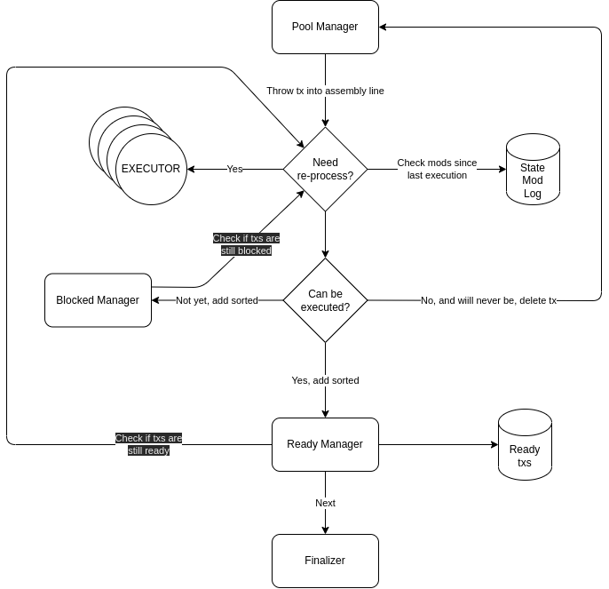

# Sequencer improvement

The sequencer is a key component of the node and the network as it gives a first level of finality which will be percieved by the users.
This document pretends to describe an architecture that helps improving the performance of it.

## Goals

> tl;dr: As per the current Ethereum behaviour (pre-EIP4844), we should try to hit **~45 kB/s throughput** while maximizing collected fees

- Maximize profit: sequencer main goal as an actor is to maximize profit. At this point in time MEV techniques are out of the equation. Therefore, the only way to maximize profit if by optimizing fee collection and reducing operational cost. In this iteration reducing operational cost (having as many transactions / batch, L1 tx gas price, ...) will not be taken into consideration deeply
- Throughput: how many transactions per second can we process? How many time a user needs to wait from tx sent to tx added into the state? Sequencer duty is to be as fast as possible to bring a great UX into the network. Since there is a hard limit imopsed by L1 (Ethereum), the sequencer should try to reach this limit.

Ethereum imposed throughput limit:


```
Max bytes per block = X
Gas consumption = X * gas cost per byte + other gas consumption from the SC call
Max gas consumption = Block gas limit * percentage of the block the zkEVM shouldn't exceed
Max gas consumption = Gas consumption
Throughput limit = X / block time
```

Given the previous equation, with the following numbers:

- Gas cost per byte (call data) = K = 16 gas/Byte
- Other gas consumption from the SC call ~= Z ~= 250.000 gas
- Block gas limit = M = 30.000.000 gas
- Percentage of the block the zkEVM shouldn't exceed = P = 0.3
- Block time = T = 12s

The max throughput is

```
(M*P-Z)/(K*T) = Max Bytes/s
```

```
(30.000.000*0.3 gas -250.000 gas) / (16 gas/Byte * 12s) = 45kB/s
```

## Assumptions and perspective

- All transactions **must** be processed sequentialy before considering them final. Therfore in order to reach the goals described above, the design should aim at:
  - Having a great hit ratio (successfuly processed txs / total processed txs). Note that a reverted tx is considered successful, a not successful tx would mean that either it violates the intrinsic checks or it out of counters
  - Minimizing time between txs are processed (as soon as one tx has been processed the next one starts)
  - Txs are sorted by max gas price
- Although there is a point in the system which can't be run in paralel there is no reason to have a system which is 100% sequential
- Processing transactions is a job done by the [executor](https://github.com/0xPolygonHermez/zkevm-prover) and it's performance is out of the scope of this document. An awesome and super fast performance will be assumed
- The system should be able to resume operations after any of it's components crashes. This is an important consideration whenever thinking wich pieces of data will be stored only in memory

## Architecture propposal



In order to follow the full concept, different parts of the system will be introduced separetly, and then will be put together at the end of the document.

Note that the different ideas are meant as abstract and don't suggest infrastructure or implementation details (unless the opposite is said). For instance, in the following diagrams shapes that usually represent DBs are used, but in this case they could be implemented using in memory structures, messaging systems (such as Apache Kafka) or actual DBs

### Finalizer

This is the component responsible for executing transactions sequentially and giving finality



The finalizer will consume data from 3 sources, after each interaction it will query this 3 sources in order:

- `Forced Batch Manager`: will indicate when a forced batch needs to be added in the state. When this happens the finalizer will close the open batch, process the forced batch(es) and finaly open a new batch
- `GER manager`: will indicate when a new GER or timestamp needs to be used. When this happens the finalizer will close the open batch, and open a new batch with the updated GER and timestamp
- `Ready Manager`: it's responsible for giving the next transaction to be executed, and should be the most frequently used source. Note that the delay between a request and a response for the next transaction to be processed and the hit ratio of the suggested transactions are a key part of the system.

In order to execute the transactions the `Super Executor` will be used. This is actually a normal executor, but it has this name to help understand that this specific instance needs to be the one performing the best, and should be used exclusively by the finalizer.

After (successfuly) executing transactions the finalizer will:

- Update the state with the new items (add to `StateDB`)
- Append the new `state mod logs`

On the other hand if the execution fails (this case is only considered when consuming data from the `Ready Manager` source), the failed transactions will be sent to the `Blocked Manager` (note that this component is ommited in the diagram, more on this later)

> QUESTION: is it really possible to update GER, timestamp and process transactions **without being aware of the batch number**?

AMSWER: YES, after the bridge L2 SC is updated to not link GERs with batch numbers, batch numbers will stop having an impact on the L2 state.

### State mod log

This component is a sorted list of logs that communicate changes on the state. The main purpose of it is to help other components understand if a given transaction can be processed without actualy executing it.

The content of this log should be something like this

```json
{
    "0xOldRoot0": {
        "nextRoot": "0xOldRoot1",
        "timestamp": 7389545793,
        "GER": "0x42399847972",
        "0xAddr0": {
            "nonce": 1337,
            "balance": "100000000000000000000000000",
            "storageModified": false
        },
        "0xAddrN": {
            "nonce": null,
            "balance": "0",
            "storageModified": true
        }
    },
    "0xOldRootN": {
        "nextRoot": "0xOldRootN+1",
        "timestamp": null,
        "GER": null,
        "0xAddr0": {
            "nonce": 7331,
            "balance": "22222222222222",
            "storageModified": false
        },
        "0xAddrN": {
            "nonce": null,
            "balance": "0",
            "storageModified": true
        } 
    }
}
```

Note that:

- For each root (1 new root == 1 tx), there is a list of all addresses that has been modified
- A mechanism to navigate from one log to the following one, in the example this is represented by linking to the `nextRoot`, but this could be done in a different way. The advantadge of doing it like this is re-org safetyiness

### Ready manager

The purpose of this component is to provide txs to the `finalizer` as soon as it has finished executing the transaction that is WIP. Ideally the order in which this txs will be picked up by the executor will:

- Maximize the hit ratio
- Maximize fees

In other words the performance of this component can be evaluated from these points of view:

- Response time:
- Accuracy

This factors can ofthe be opposed, a trade off. To ilustrate this let's see two examples of possible strategies:

- Return the first transaction of the list: super fast, unexpected results
- Execute all the pontential combinations of transactions and return the best transaction: super slow, best result

In order to have a balanced solution, the two problems can be splitted:

- A routine keeps the list of txs sorted
- The first tx of the list should always be quite accurate and ready to be consumed by the `finalizer` as soon as it requests it. Alternatively, there could be a timeout, the `ready manager` would have this timeout as deathline to find the most safe/accurate and profitable transaction

With all of this in mind let's jump into a more detailed explanation of how it works



In terms of flow, the `ready manager` has three key interactions:

1. **Add transactions:** will receive transactions form the `blocked manager` and the `pool manager`, more on them later. After receiving a transaction, it will be stored on a queue of ready txs sorted. The sorted algorithm will go as follows:

```go
func (rm *ReadyMan) AddSortedTx(tx PoolTx) error {
    for i := len(rm.readyTxs)-1; i >= 0; i-- {
        if newTx.needs(rm.readyTxs[i]) {
            // execute tx on top of rm.readyTxs[i]
            // if success add tx at position i+1
            // else discard tx and return err
        }
        if newTx.GasPrice < rm.readyTxs[i].GasPrice {
            if newTx.dependsOn(rm.readyTxs[i]) {
                // execute tx on top of rm.readyTxs[i]
                // if success add tx at position i+1
                // else discard tx and return err
            } else {
                // add tx at position i+1
            }
        }
        if i == 0 {
            // add tx at position 0
        }
    }
    return nil
}
```

Note that:
- this algorithm has O(N), which is nice because it needs to go faster when there are fewer txs in the queue. Keep in mind that a tx will be only executed once (or not at all), therefore it's extremely unlikely that the `finalizer` can consume txs faster than the `ready manager` can add them sorted.
- It should take into consideration ANY tx dependency except timestamp [nonce, balance, SC]
- The tx may fail at being added, in that case it should go to the `blocked manager` or be completley deleted
- Consecutive nonce txs that play with the concept of having the tx with the greatest nonce with the bigger fee will be fully deprioritaized with this algorithm. However this can be take into account by slightly complicating the algorithm: when adding a tx push down the queue txs if they're from the same account and have higher fee
- *TODO:* PoolTx assumes that it has `txDependency` and `stateMod` inside in order to be able to implement `needs` and `dependsOn`

2. **Pop transactions:** it's the mechanism in which the `finalizer` request the best tx. A reasonable first iteration could be to inmedaitley pop the first tx in the queue
3. **Maintainance:** this is a mechanism that tries to ensure that all the txs will be executed successfuly in the current order. There are a few situations that may alter the execution (having in mind that dependency on transactions bellow the queue have already been taken into consideration when adding them into the queue):

- When a transaction is added into the queue, the existing transactions above could be affected and hance become invalid
- Timestamp/blockheader is changed
- Forced batch is executed

With this in mind, an algorithm that identifies what transactions need to be reprocessed, and sanitize de queue can be done:

```go
func (rm *ReadyMan) CleanQueue(tx PoolTx) error {
    for i := 0; i < len(rm.readyTxs); i++ {
        rm.readyTxs[i].updateStatus() 
        switch rm.readyTxs[i].status {
		case readyWithMod:
		case ready:
		case blocked:
		case invalid:
        }
    }
}
```

## TODO: (ideas and so...)

- Batchbuilder is finalizer, finalizer is QA ==> they need to work close

- If balance, nonce and SC dependencies are not modified since last check, the tx will be executed successfuly
- The NFT mint as worst case
- The consecutive nonce as bad handled case
- Other dependendies (tx A depends on tx B)... how do we deal with it?
  - Depends on tx ==> Execute on top of
- Chenge ZK Counter behaviour ==> same as OOG?
  - IF EXECUTED IN A SINGLE BATCH SLASH GAS LIMIT
- Make call data expensive
- If we're going to pay for deposit claims (0 fee), why not do it directly on behalf of the user? ==> YASSU
  - MERGE bridge service?
- Finality for L1 stuff (forced/deposit): https://www.alchemy.com/overviews/ethereum-commitment-levels
  - https://ethereum.github.io/beacon-APIs/#/Beacon/getStateFinalityCheckpoints

## Request for executor / protocol

- Light trace: option to return:
  - Read addrs and type
  - Write addrs and type
  - Uses timestamp?
- Batch num doesn't affect the state
- GER update can be ommited / doesn't affect the state